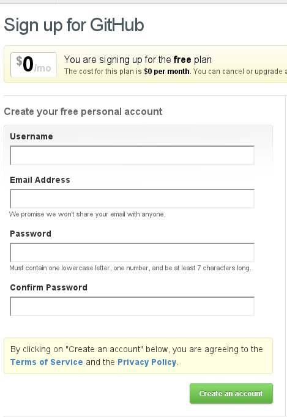
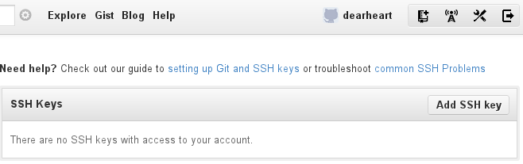
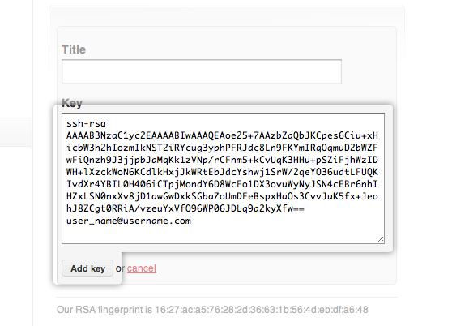
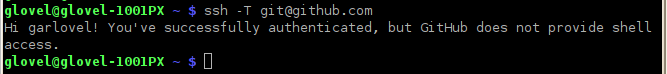
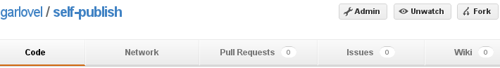
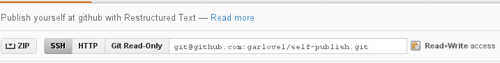
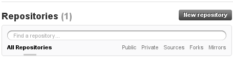
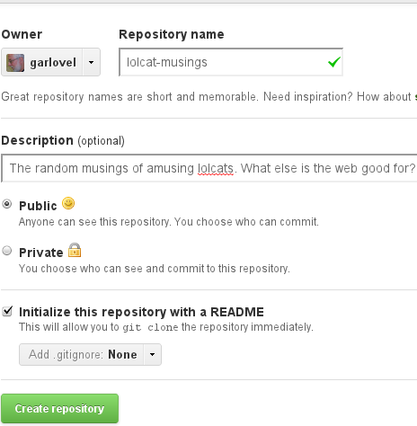

.. _host:

#############################
 Right Hosting
############################# 

From the many options for free repository storage and hosting, one is enough. 
This guide recommends GitHub for its excellent documentation and good feature 
set. [#]_

Register a GitHub Account
=============================

If you lack a GitHub account, here are instructions.

Register for free:
-----------------------------

+ Click this link to `the GitHub signup page <https://github.com/signup/free>`_. 
+ Enter your information (four fields).
+ Click on :guilabel:`Create an account`.

Add an SSH Key:
-----------------------------

+ Click the wrench to the right of your name, :guilabel:`Account Settings`,
+ Then select :guilabel:`SSH Keys` from the settings menu on the left.
+ On the "SSH Keys" bar, click the :guilabel:`Add SSH key` button.

+ Switch to the console, and enter the command :command:`kate ~/.ssh/id_rsa.pub`.
+ In Kate, press :kbd:`<Ctrl-A>,<Ctrl-C>`, then close without saving.
+ Switch to the browser, click in :guilabel:`Key`, and press :kbd:`<Ctrl-V>`.
+ Click in :guilabel:`Title`, and enter the workstation@username and date.
+ Click the button :guilabel:`Add key` to finish.

Verify ssh with login
-----------------------------

+ Back to the console, enter :command:`ssh -T git@github.com`.
+ At the "Are you sure ... (yes/no)?" question, type :kbd:`yes`, press :kbd:`<Enter>`.
+ You should get a response that you have successfully authenticated:

.. Note::

  Each workstation you use will require a different ssh key.

Fork a Remote Project
=============================

There is no need to start from scratch when creating a documentation project. 
Instead, clone or fork someone else's open source work. With your GitHub 
account, 

+ visit `my GitHub page <https://github.com/garlovel>`_ 
+ find the :kbd:`self-publish` repository and click the name,
+ then click the :guilabel:`fork` button at the top right of the page.

GitHub will make a copy of the self-publish repository for you, and then switch 
to view your copy.

Clone a Remote Project
=============================

Once you own a repository on GitHub, you will want to clone it. The GitHub 
repository is remote, and cloning makes a local copy which you can edit. 
Here is the console command::

  git clone (link_to_your_project) ~/Projects/doc-publishself

There are two parameters to the :command:`git clone` command. First is your 
project name, which is the text following "Git Read-Only" in the image below. 
(But copy the text from your fork of the repository please, so it will have 
your name instead of mine.) The second parameter is the folder name to create 
for the project.

Ask Git a Question
=============================

Type the following commands to query git in the :file:`doc-publishself` 
project:: 

  cd ~/Projects/doc-publishself
  git branch -a

Git shows two branches in this project, **gh-pages** and **master**, and 
**master** is active. If the source is in branch **master**, then what is in 
the **gh-pages** branch?

Git an Answer
=============================

The answer is, gh-pages contains HTML pages and other content for the website 
you are viewing. 

Now let's create a gh-pages branch for your doc-firsttask repository. Here are 
the commands::

  cd ~/Projects/doc-firsttask
  git add .
  git commit -m "Commit all current changes before branching"
  git symbolic-ref HEAD refs/heads/gh-pages
  rm .git/index
  git clean -fdx
  git branch master

Refer to the **Project Pages Manually** section of `GitHub help 
<http://help.github.com/pages/>`_ for more information.

Pushing to GitHub
=============================

You may have noticed: **doc-publishself** contains a repository from GitHub. 
Committed changes in the doc-publishself folder are updated to GitHub with the 
command :command:`git push`. 

Moving Projects to GitHub
=============================

On the other hand, the **doc-firsttask** repository is local to your 
workstation. To archive and share and existing project, you need to create a 
repository on GitHub. On your GitHub home page, click the 
:guilabel:`New repository` button, describe the repository, and then create it. 

Your new GitHub repository will display a remote link address, somewhat like 
:kbd:`git@github.com:__username__/__repositoryname__.git`. Using the following 
commands as a template, you can update your local repository to point to the 
new GitHub repository as a remote master::

  cd ~/Projects/doc-firsttask
  git remote add origin git@github.com:_username_/_repository_.git
  git merge origin

.. Warning:: Use the remote URL for your repository in the preceding commands, 
  instead of pasting in :kbd:`git@github.com:_username_/_repository_.git`.

------

.. rubric:: Footnotes

.. [#] Wikipedia shows a comparison of options for free repository hosting at  http://en.wikipedia.org/wiki/Comparison_of_open_source_software_hosting_facilities. 
